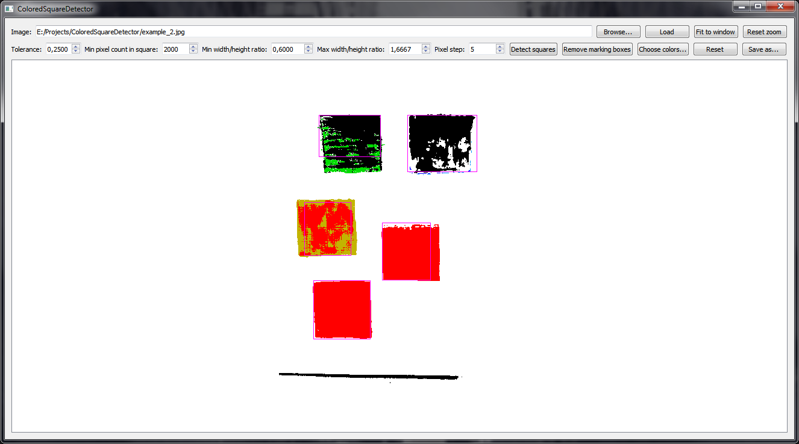

# ColoredSquareDetector
Program for detecting colored squares in images. Very customizable. Written in Qt/C++.
## Download
Download link: [Win32 binary](https://github.com/Extender/ColoredSquareDetector/raw/master/bin/coloredsquaredetector-v1.0-bin-win32.zip)
## Screenshots
### Input

### Result

